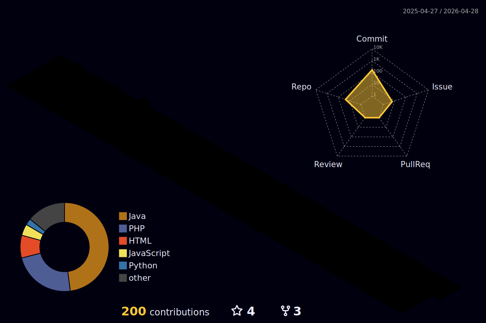

<h1 align="center">Hello World!, I'm Thiago, a Brazilian Full Stack Developer :</h1>

###

I'm currently studying Cross-Platform Software Development at Fatec Praia Grande.

###

  
  
  
  
  
  
  
  
  
  
  
  
  
  
  
  
  
  
  
  
  
  
  

###

  
  
  

###
